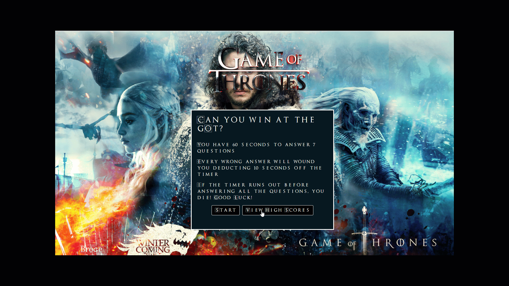

# 04-code-quiz

Game Of Thrones Quiz Homework Assignment 4
Site link https://bowdwin.github.io/04-code-quiz/
## About / Synopsis

* This is the 4th home work assignment.
* Do you have what it takes to win at the Game of Thrones? This is a 7 question 60 second quiz that will test your knowledge.
* How the game works:
    * When the user hits start
        * a sound clip is played "Is this your command" 
        * GOT theme starts playing a 60 second timer is displayed and starts counting down to 0.  
        * Once the timer reaches 20 seconds the font color changes to red. 
        * If the answer is correct, a "King of the north" sound clip is played and text of "Enemy Damaged" is displayed green for 3 seconds then dissapears.
        * If the answers is wrong - 7 seconds is deducted from the timer, a sound clip of a sword flesh wound is played as well as "wounded -7 seconds" is displayed in red.
        * If the timer reaches 0 or all 10 questions are answered the game ends.
        * When the game ends, GOT theme stops and the Night King Song is played 
        * The user is presented with a submit enter name box.
        * When the name is entered and the submit button is clicked, the name get's stored in local storage and a sound clip is played "In the GOT you either win or you die"
        * User is then presented with a high scores screen and can start over or clear scores and start over

* Project status: working/prototype

## Developed using
    * HTML
    * CSS
    * Java Script
## GIF shot of "GOT Quiz"

# Image link
Images referenced from the following 
* Background image  https://images8.alphacoders.com/802/802993.jpg

# Font Link
* GOT font https://www.fonts4free.net/game-of-thrones-font.html

# Sounds and Song Clips
* I used camtasia and pulled clips and sounds out of movies I own